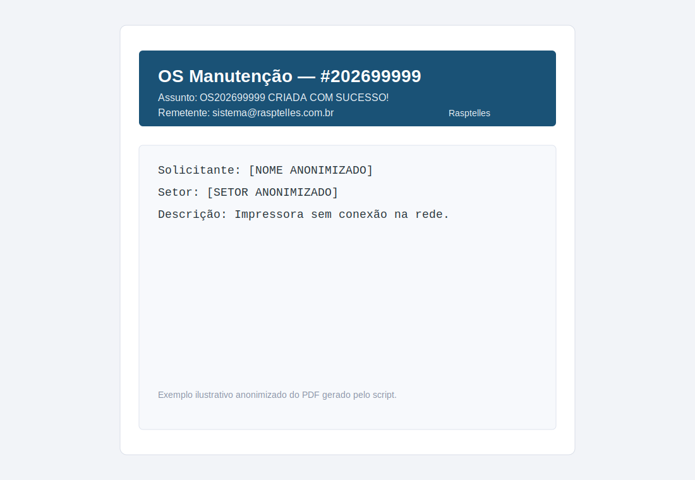

# 📦 Gmail Automation Toolkit — Chamados Archiver

> **Coleção:** Gmail Automation Toolkit  
> **Módulo:** Chamados Archiver  
> **Versão:** `1.0.0`

Automação para capturar ordens de serviço recebidas via Gmail (Rasptelles, Ksys e SMED), converter em PDFs padronizados e organizar no Google Drive por sistema, ano e mês.

---

## ✅ O que este script faz

1. Lê e-mails com marcadores por sistema
2. Extrai o número da OS do assunto
3. Gera PDF com cabeçalho visual por origem
4. Salva no Drive em `Sistema/Ano/Mês`
5. Evita duplicatas por nome de arquivo
6. Remove apenas o marcador após processamento

---

## 🖼️ Screenshot do PDF gerado

Exemplo visual (anonimizado) de como o PDF final fica:



---

## 🧪 Exemplo anonimizado de entrada e saída

### Entrada (e-mail)

```text
De: sistema@rasptelles.com.br
Assunto: OS202699999 CRIADA COM SUCESSO!
Data: 04/04/2026 08:30
Corpo:
Solicitante: [NOME ANONIMIZADO]
Setor: [SETOR ANONIMIZADO]
Descrição: Impressora sem conexão na rede.
```

### Saída (arquivo gerado)

```text
Pasta destino:
Chamados TI/Rasptelles/2026/04 - Abril/

Arquivo:
OS_202699999_2026-04-04_08-30.pdf
```

### Saída (linha de log)

```text
2026-04-04_08-30 | Rasptelles | OS #202699999 | OS202699999 CRIADA COM SUCESSO! | OS_202699999_2026-04-04_08-30.pdf
```

---

## ⚙️ Configuração rápida

1. Crie um projeto no Google Apps Script.
2. Cole o conteúdo de `chamados_archiver.gs`.
3. Copie `CONFIG.example.gs` para o bloco `CONFIG` do script e preencha os valores.
4. Configure filtros e marcadores no Gmail.
5. Crie gatilho para rodar `arquivarChamados` (ex.: a cada hora).

---

## 🧩 Arquivo de configuração de exemplo

Arquivo disponível no repositório:

- `CONFIG.example.gs`

Ele contém placeholders seguros para facilitar implantação sem expor IDs reais.

---

## 📜 Licença

MIT.
